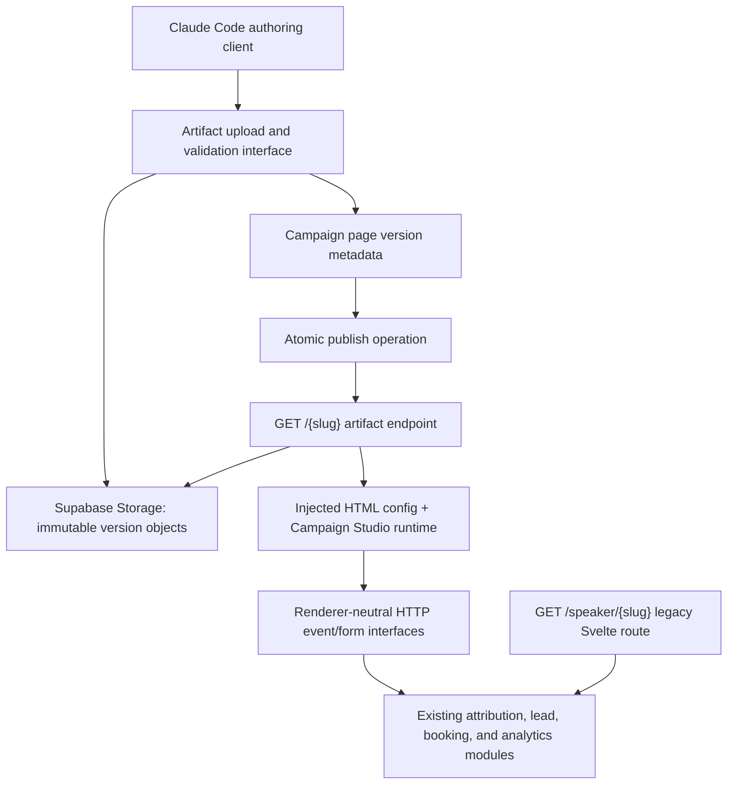

# Campaign Studio artifact runtime implementation plan

## Decision

Keep the existing section-rendered public pages at `/speaker/[slug]` and introduce the artifact renderer at the root public route `/[slug]`.

This is a cleaner seam than switching renderers inside `/speaker/[slug]`:

- `/speaker/[slug]` remains the established speaker-page experience and keeps its current Svelte page, section renderer, SEO, experiment, navigation, booking, and remote-function behavior.
- `/[slug]` becomes an HTTP endpoint that resolves a published artifact version, injects the Campaign Studio runtime configuration, and returns the artifact's HTML as a raw `Response`.
- Renderer type remains explicit in persisted page/version metadata. Routing chooses the rendering adapter, while renderer type still governs upload validation, preview, publishing, live-URL generation, and API behavior.

No SvelteKit configuration change is required beyond adding the route. Use `src/routes/[slug=artifact]/+server.ts` with a parameter matcher in `src/params/artifact.ts`. Static routes such as `/login`, `/campaigns`, `/api`, `/book`, and `/speaker` remain more specific, but their top-level segments must be reserved so an artifact cannot be published at an unreachable or future-conflicting slug.

## Product-specification gate

This reframe intentionally contradicts the current approved [`docs/SRS.md`](SRS.md), which places structured page representation and predefined component rendering inside the MVP scope. The architecture can be planned and prototyped now, but production implementation should begin only after the SRS is revised or superseded and an ADR records the new renderer/route decision. Otherwise the repository's stated decision priority still requires agents to preserve the section-only architecture.

## Current architecture map

### Public routing and rendering

- [`src/routes/speaker/[slug]/+page.server.ts`](../src/routes/speaker/%5Bslug%5D/+page.server.ts) resolves a published `campaign_pages` row by slug, requires the owning campaign to be published, parses `structured_content_json`, builds speaker-specific JSON-LD, and resolves the speaker hero experiment.
- [`src/routes/speaker/[slug]/+page.svelte`](../src/routes/speaker/%5Bslug%5D/+page.svelte) owns GTM, Vercel Analytics, visit/engagement logging, speaker navigation, booking slot loading, shallow-route modals, and `PageRenderer`.
- [`src/lib/components/page-renderer/PageRenderer.svelte`](../src/lib/components/page-renderer/PageRenderer.svelte) maps validated section objects to the registered Svelte section implementations.
- [`src/routes/embed/[slug]`](../src/routes/embed/%5Bslug%5D) is a tokenized section-page preview, not a generic artifact host.
- The application uses `@sveltejs/adapter-vercel` in [`svelte.config.js`](../svelte.config.js). A SvelteKit `+server.ts` handler is therefore the natural raw-response seam for artifact HTML.

### Page identity, versions, and publishing

- [`campaign_pages`](../src/lib/server/db/schema.ts) currently represents a section page version rather than a stable logical page. It contains `campaign_id`, `version_number`, `structured_content_json`, `slug`, `is_published`, and `published_at`.
- The partial unique index permits only one published row per slug globally.
- [`persistGeneratedLandingPage`](../src/lib/server/agents/landing-page-pipeline.ts) creates a new unpublished row for every section-page revision.
- [`publishCampaign`](<../src/routes/(app)/campaigns/%5Bid%5D/campaign-status.remote.ts>) unpublishes the campaign's other page rows, publishes the selected row, and points the latest ad package at it.
- Analytics and attribution use `campaign_pages.id` as `campaign_page_id`. Preserving that identifier in the first artifact milestone avoids a broad analytics migration.

### Analytics and attribution

- [`logCampaignVisit`](../src/lib/server/attribution/campaign-visits.ts) is already renderer-independent domain logic. It writes `campaign_visits`, captures UTM/referrer/Vercel geo data, uses the `cs_vid` HTTP-only visitor cookie, and deduplicates visits for 30 minutes.
- The public CTA endpoint at [`/api/attribution/cta`](../src/routes/api/attribution/cta/+server.ts) already validates a renderer-neutral CTA event and resolves the current visit from the visitor cookie.
- [`logLeadEvent`](../src/lib/server/attribution/lead-events.ts) and the journey-attribution modules are reusable below either renderer.
- The section route currently exposes visit logging only through a Svelte remote command. Artifact pages need a normal HTTP endpoint that calls the same underlying visit functions.
- Experiment behavior is currently speaker-route-specific. Do not automatically assign artifact pages to the speaker hero experiment.

### Forms and booking

- Section forms contain substantial orchestration directly in Svelte remote-function files, notably `LeadInlineIntakeForm.remote.ts`, `LeadInlineBookingSequence.remote.ts`, and `FrictionlessFunnelSection.remote.ts`.
- [`/api/leads/intake`](../src/routes/api/leads/intake/+server.ts) is a Webflow-oriented HTTP surface. It duplicates parts of inline lead intake and uses Webflow-specific source names and fallback behavior, so it should not become the artifact runtime contract unchanged.
- Booking already has useful deep modules under [`src/lib/server/bookings`](../src/lib/server/bookings). The coupling that remains is in the remote-function adapters and Svelte presentation.
- The existing booking UI is a substantial Svelte module. An iframe-based island is the least disruptive first adapter because it isolates CSS and JavaScript while preserving the maintained Svelte implementation and its remote functions.

### Storage and external authoring API

- No current application code uses Supabase Storage for page artifacts.
- The public API under [`/api/public/v1`](../src/routes/api/public/v1) already supports bearer-authenticated campaign creation/navigation and lead inspection, but campaign creation requires structured section JSON.
- Its OpenAPI description and live URL builder currently assume `/speaker/{slug}` and section-page previews.

## Target architecture



The external rendering seam has two adapters:

1. The existing section adapter: Svelte route and `PageRenderer` at `/speaker/[slug]`.
2. The artifact adapter: raw HTML endpoint at `/[slug]`.

Analytics, attribution, lead intake, and booking remain below that seam. Do not add artifact-specific analytics tables or business rules.

## Minimal schema change

For the first milestone, retain `campaign_pages` as the version record so existing foreign keys and reports continue to work.

1. Add a `page_renderer_type` Postgres enum with `sections` and `artifact`.
2. Add `campaign_pages.renderer_type`, non-null with default `sections`.
3. Make `structured_content_json` nullable, with a check constraint:
   - `sections` requires non-null structured content, which application code continues to validate with the existing schema.
   - `artifact` requires no structured section content.
4. Add `page_artifacts` as a one-to-one extension of an artifact `campaign_pages` version:
   - `id` UUID primary key
   - `campaign_page_id` unique foreign key
   - `storage_bucket`
   - `storage_prefix`
   - `entrypoint` (initially always `index.html`)
   - `manifest_json` with normalized path, media type, byte size, and SHA-256 for every file
   - `content_sha256`
   - `created_at`
5. Keep `is_published`/`published_at` for the milestone and make artifact publication use the same campaign transaction semantics as section publication.

Do not add `active_version_id` in this milestone. The current model already selects the active version with `is_published`, and introducing a stable logical-page table at the same time would force changes through attribution, ad-group relationships, public APIs, and admin views. A later schema deepening can introduce a stable `landing_pages` identity and `landing_page_versions` only when multiple pages per campaign or renderer-independent version identity is required.

## Root route contract

Add:

```text
src/params/artifact.ts
src/routes/[slug=artifact]/+server.ts
```

The matcher accepts the canonical slug format and rejects reserved top-level application segments. Publishing must apply the same validator. Initial reserved segments include at least:

```text
account, admin, api, book, campaign, campaigns, confirm, embed,
login, no-follow, preview, register, signout, speaker
```

Add a route-reservation test so a new top-level application route cannot silently shadow an already valid artifact slug.

`GET /[slug]` should:

1. Resolve a published `campaign_pages` row with `renderer_type = artifact` and a published owning campaign.
2. Resolve the attached immutable artifact manifest.
3. Fetch only `index.html` from storage.
4. Reject a missing, oversized, or hash-mismatched entrypoint.
5. Inject a serialized, HTML-escaped public configuration object and one pinned runtime script immediately before `</head>` or `</body>`.
6. Return a raw HTML `Response` with explicit security and cache headers.

The route must not use `{@html}`, must not render a Svelte page, and must not contain analytics/form business logic.

Do not add a `+page` beside this `+server.ts`; for browser `GET`/`HEAD` requests, SvelteKit content negotiation would prefer the page when `Accept` prioritizes HTML. Links from the Svelte-rendered app to an artifact document must force a full navigation with `data-sveltekit-reload` (or an equivalent external navigation) rather than attempting client-side Svelte page navigation.

## Artifact storage and URL policy

Use a private source bucket for entrypoint HTML/manifests and a public immutable asset bucket for browser-loadable assets. This prevents a public storage URL from becoming an uninstrumented alternate entrypoint while still allowing the storage CDN to serve images, fonts, and styles directly. Use content-addressed version prefixes, for example:

```text
page-artifact-source/{campaignId}/{campaignPageId}/{contentSha256}/index.html
page-artifact-source/{campaignId}/{campaignPageId}/{contentSha256}/manifest.json
page-artifact-assets/{campaignId}/{campaignPageId}/{contentSha256}/assets/...
```

Upload extracted files individually, not as a ZIP used at request time. A ZIP may be accepted as the authoring transport, but the upload interface must validate and extract it before a version becomes previewable. Never unzip during a public page request.

At upload time:

- Reject absolute paths, `..`, symlinks, duplicate normalized paths, executable server files, and configured size/count overages.
- Require exactly one entrypoint.
- Generate the manifest server-side.
- Rewrite local HTML/CSS asset references to immutable absolute object URLs, or inject an immutable absolute `<base href>` that points at the version prefix. Rewriting is safer because a `<base>` element also changes navigation and form-action resolution.
- Keep external URLs explicit and preserve query/hash suffixes.

Public immutable assets should be served directly by the storage CDN with a long immutable cache policy. The SvelteKit function should serve only the small HTML entrypoint so asset traffic does not consume function bandwidth or execution time.

Keep the HTML comfortably below Vercel's documented 4.5 MB Function request/response payload limit. Large scripts, styles, fonts, images, and video belong on the object-storage CDN rather than being proxied through the SvelteKit function.

The HTML response can use `Cache-Control: public, s-maxage=60, stale-while-revalidate=300` initially. Publish/rollback changes which immutable version the slug resolves to, so HTML must not be cached forever. Add an `ETag` derived from the artifact content hash and runtime injection version.

## Runtime contract v1

Inject JSON as inert data rather than executable inline JavaScript:

```html
<script id="cs-page-context" type="application/json">
	{ "campaignId": 1, "campaignPageId": 2, "versionId": 2, "slug": "example" }
</script>
<script src="/campaign-runtime/v1.js" defer></script>
```

Supported author markup for milestone one:

```html
<a
	href="mailto:..."
	data-cs-action="cta"
	data-cs-cta-type="email"
	data-cs-cta-key="hero-email"
	data-cs-cta-section="hero"
	>Contact Christoph</a
>

<form data-cs-form="lead-intake" data-cs-form-key="hero-lead">
	<!-- canonical field names -->
</form>

<div data-cs-widget="booking-calendar"></div>
```

Keep the vocabulary small and versioned. Prefer specific attributes (`data-cs-cta-key`) over an open-ended event name that callers can use to invent analytics semantics.

Runtime v1 responsibilities:

- POST a page view and retain the returned visit ID in memory.
- Mark engagement after the existing threshold and before external navigation when possible.
- Delegate CTA clicks, push the existing GTM event where required, and call `/api/attribution/cta` with server-supplied page identity.
- Intercept known lead forms, submit canonical fields, and render accessible pending/success/error states.
- Mount known widgets.
- Ignore unknown `data-cs-*` values and report a diagnostic console warning in non-production previews.

The runtime must never trust campaign IDs or page IDs authored into the uploaded HTML. Identity comes only from the server-injected context.

## Renderer-neutral HTTP interfaces

Add thin HTTP adapters over shared domain functions:

- `POST /api/runtime/v1/visits`
- `POST /api/runtime/v1/visits/engagement`
- Reuse `POST /api/attribution/cta` after tightening page-context validation, or expose it through a versioned runtime alias.
- `POST /api/runtime/v1/forms/lead-intake`

Before adding the lead endpoint, extract the common inline-intake orchestration from both the Svelte remote function and the existing Webflow endpoint into one server-only module. Its interface should accept validated lead data, trusted campaign/page context, request attribution context, and a named surface; it should return a renderer-neutral result. The Svelte remote function, Webflow endpoint, and artifact endpoint then become adapters at the same seam.

Apply the same approach to booking confirmation only when the booking island needs a normal HTTP adapter. The initial iframe island can continue using its existing Svelte remote functions while passing server-signed page context into the widget route.

All state-changing endpoints need same-origin enforcement, request-size limits, Zod validation, rate limiting, and server-side verification that the referenced page is currently published and belongs to the campaign.

## Booking island

Milestone one should use a dedicated iframe route, for example:

```text
/widgets/booking?context={short-lived signed token}
```

The runtime replaces `data-cs-widget="booking-calendar"` with a sandboxed iframe. The widget route renders the maintained Svelte booking module, loads slots through existing booking modules, and posts resize/completion messages to the parent. The signed token binds campaign, campaign page, artifact version, allowed widget, and expiration; the HTML author never supplies trusted numeric IDs.

An independently mountable custom element can be considered later if iframe theming or interaction proves inadequate. It is not the first milestone because it would require extracting the booking presentation, CSS, remote-function transport, and lifecycle into a separately built client bundle all at once.

## Preview, publish, rollback, and atomicity

- Upload creates an unpublished artifact `campaign_pages` version plus its `page_artifacts` row only after every object and manifest validation succeeds.
- Preview uses a tokenized endpoint such as `/artifact-preview/{campaignPageId}?token=...`; it resolves one immutable version and sends `Cache-Control: private, no-store` plus `X-Robots-Tag: noindex`.
- Publish runs in a database transaction: lock the campaign's versions, validate artifact presence/hash/manifest, unpublish the previous row, publish the selected row, and update campaign/ad relationships.
- Rollback is publication of an earlier immutable artifact version. No object copying or mutation is needed.
- Failed uploads remain unreachable and should be garbage-collected after a retention period.

Do not reuse `/embed/[slug]` for artifact preview; it assumes section JSON and the Svelte renderer.

## Security model

Arbitrary HTML/JavaScript served on the same origin as the authenticated admin app is privileged same-origin code. It can issue authenticated requests and inspect non-HTTP-only browser storage. Treat this as the main architectural risk, not merely an HTML-sanitization detail.

For milestone one, choose one explicit trust policy:

1. Recommended: uploaded artifacts may contain HTML/CSS but no author JavaScript. Strip/reject scripts, inline event handlers, `javascript:` URLs, plugin embeds, and unsafe resource origins. Campaign Studio's pinned runtime provides behavior.
2. If arbitrary author JavaScript is required, serve artifact pages from a separate public origin/subdomain with no admin authentication cookies, even if the user-facing path is routed there at the edge.

Do not promise both unrestricted same-origin JavaScript and meaningful isolation. CSP should still be explicit: deny framing unless required, restrict scripts to the pinned runtime, restrict connections to known runtime endpoints, and use a nonce or hash if any injected executable script remains.

## Claude Code authoring interface

Extend the existing bearer-authenticated `/api/public/v1` surface with a deployment workflow:

1. `POST /campaigns/{campaignId}/artifact-versions` creates an upload session and returns constraints plus presigned upload targets.
2. Upload bundle files or one ZIP transport.
3. `POST /artifact-versions/{id}/finalize` validates/extracts, creates the immutable manifest, and returns the preview URL.
4. `POST /artifact-versions/{id}/publish` atomically publishes it and returns `/{slug}`.
5. `POST /artifact-versions/{id}/rollback` can be represented as publishing an older version rather than a distinct primitive.
6. Existing analytics and leads read interfaces remain the source of results.

Publish a small machine-readable authoring contract containing bundle limits, canonical field names, supported `data-cs-*` attributes, widget names, and examples. Claude should need the contract, not knowledge of the database or Svelte implementation.

## First milestone slices

1. **Artifact identity and upload**: schema enum/table, reserved slug validator, private write API, immutable storage layout, manifest validation, and tokenized preview.
2. **Raw root serving**: `/[slug=artifact]/+server.ts`, safe HTML injection, absolute asset URLs, cache/ETag/security headers, and route collision tests.
3. **Runtime analytics**: runtime asset, renderer-neutral visit/engagement endpoints, and reuse of the existing CTA endpoint. Prove one page view and one CTA click appear in existing reporting.
4. **Lead intake**: extract common lead orchestration into a deep server module, adapt the legacy remote function without behavior change, and add the runtime HTTP adapter.
5. **Booking island**: signed-context widget route and iframe mounting.
6. **External authoring workflow**: finalize/publish API, OpenAPI updates, and one end-to-end Claude Code example.

Each slice should ship without changing `/speaker/[slug]`. The milestone is complete when one artifact page at `/{slug}` can be uploaded, previewed, published, visited, CTA-tracked, lead-submitted, attribution-linked, booking-enabled, rolled back, and reported alongside section pages.

## Backward compatibility

- Keep existing `campaign_pages` rows defaulted to `renderer_type = sections`.
- Do not modify `/speaker/[slug]`, `/embed/[slug]`, `PageRenderer`, section schemas, or the existing production page data in the first milestone.
- Keep current section live URLs at `/speaker/{slug}` permanently unless an explicit later migration redirects an individual page.
- Generate live URLs by renderer type in admin and public API responses.
- Preserve `campaign_page_id` in visits, lead events, email aliases, ad groups, and reports.
- Do not apply artifact CSP/runtime behavior globally in `hooks.server.ts`; scope headers and injection to the artifact endpoint and widget routes.

## Eventual retirement candidates

After artifact authoring proves reliable, the internal AI generation pipeline, section-selection agents, AI editing UI, and most page-builder administration can be marked legacy. Retain them while any production section pages depend on their documents and renderer.

The section registry and `PageRenderer` remain runtime dependencies as long as `/speaker/[slug]` pages exist. Attribution, analytics, campaigns, page/version metadata, publishing, public APIs, booking modules, notifications, and email attribution become more central rather than less.

## Explicit non-goals for the first milestone

- Migrating existing speaker pages to artifacts.
- Replacing SvelteKit or Vercel.
- Building a general-purpose arbitrary-code hosting platform.
- Introducing a second analytics model.
- Redesigning the admin application.
- General A/B test authoring for artifact pages.
- Multiple logical landing pages per campaign.
